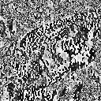
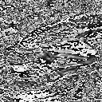

# Q.11 - 20

## Q.11. 平滑化フィルタ

平滑化フィルタ(3x3)を実装せよ。

平滑化フィルタはフィルタ内の画素の平均値を出力するフィルタである。

|入力画像 (imori.jpg)|出力画像 (answer_11.jpg)|
|---|---|
|||

答え >> answer_11.py

## Q.12. MAX-MINフィルタ

MAX-MIJフィルタ(3x3)を実装せよ。

MAX-MINフィルタとはフィルタ内の画素の最大値と最小値の差を出力するフィルタであり、**エッジ検出**のフィルタの一つである。
エッジ検出とは画像内の線を検出るすることであり、このような画像内の情報を抜き出す操作を**特徴抽出**と呼ぶ。
エッジ検出では多くの場合、グレースケール画像に対してフィルタリングを行う。

|入力画像 (imori.jpg)|出力画像 (answer_12.jpg)|
|---|---|
|||

答え >> answer_12.py

## Q.13. ソーベルフィルタ

ソーベルフィルタ(3x3)を実装せよ。

ソーベルフィルタは特定方向（縦や横）のエッジのみを抽出するフィルタであり、次式でそれぞれ定義される。

```bash
   (a)縦方向    (b)横方向
   1 0 -1       1  2  1
 [ 2 0 -2 ]   [ 0  0  0 ]
   1 0 -1      -1 -2 -1
```

|入力画像 (imori.jpg)|出力画像・縦方向 (answer_13_vertocal.jpg)|出力画像・横方向 (answer_13_horizontal.jpg)|
|---|---|---|
||||

答え >> answer_13.py
