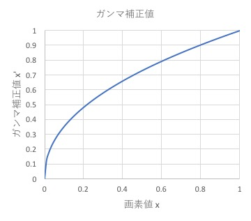
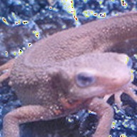

# Q. 21 - 30


## Q.21. ヒストグラム正規化

ヒストグラム正規化を実装せよ。

ヒストグラムは偏りを持っていることが伺える。
例えば、0に近い画素が多ければ画像は全体的に暗く、255に近い画素が多ければ画像は明るくなる。
ヒストグラムが局所的に偏っていることを**ダイナミックレンジが狭い**などと表現する。
そのため画像を人の目に見やすくするために、ヒストグラムを正規化したり平坦化したりなどの処理が必要である。

このヒストグラム正規化は**濃度階調変換(glay-scale transformation)** と呼ばれ、[c,d]の画素値を持つ画像を[a,b]のレンジに変換する場合は次式で実現できる。
今回は*imori_dark.jpg*を[0, 255]のレンジにそれぞれ変換する。

```bash
xout = {  a                         (xin < c)
         (b-a)/(d-c) * (xin-c) + a  (c <= xin <= d)
          b                         (d < xin)
```

|入力画像 (imori_dark.jpg)|出力画像 (answer_21_1.jpg) |ヒストグラム(answer_21_2.jpg)|
|:---:|:---:|:---:|
||||

答え >> answer_21.py

## Q.22. ヒストグラム操作

ヒストグラムの平均値をm0=128、標準偏差をs0=52になるように操作せよ。

これはヒストグラムのダイナミックレンジを変更するのではなく、ヒストグラムを平坦に変更する操作である。

平均値m、標準偏差s、のヒストグラムを平均値m0, 標準偏差s0に変更するには、次式によって変換する。

```bash
xout = s0 / s * (xin - m) + m0
```

|入力画像 (imori.jpg)|出力画像 (answer_22_1.jpg) |ヒストグラム(answer_2_2.jpg)|
|:---:|:---:|:---:|
||||

答え >> answer_22.py

## Q.23. ヒストグラム平坦化

ヒストグラム平坦化を実装せよ。

ヒストグラム平坦化とはヒストグラムを平坦に変更する操作であり、上記の平均値や標準偏差などを必要とせず、ヒストグラム値を均衡にする操作である。

これは次式で定義される。
ただし、S ... 画素値の総数、Zmax ... 画素値の最大値、h(z) ... 濃度zの度数

```bash
Z' = Zmax / S * Sum{i=0:z} h(z)
```

|入力画像 (imori.jpg)|出力画像 (answer_23_1.jpg) |ヒストグラム(answer_23_2.png)|
|:---:|:---:|:---:|
||||

答え >> answer_23.py


## Q.24. ガンマ補正

*imori_gamma.jpg*に対してガンマ補正(c=1, g=2.2)を実行せよ。

ガンマ補正とは、カメラなどの媒体の経由によって画素値が非線形的に変換された場合の補正である。
ディスプレイなどで画像をそのまま表示すると画面が暗くなってしまうため、RGBの値を予め大きくすることで、ディスプレイの特性を排除した画像表示を行うことがガンマ補正の目的である。

非線形変換は次式で起こるとされる。
ただしxは[0,1]に正規化されている。
c ... 定数、g ... ガンマ特性(通常は2.2)

```bash
x' = c * Iin ^ g
```

そこで、ガンマ補正は次式で行われる。

```bash
Iout = (1/c * Iin) ^ (1/g)
```

 

|入力画像 (imori_gamma.jpg)|出力画像 (answer_24.jpg)|
|:---:|:---:|
|||

答え >> answer_24.py


## Q.25. 最近傍補間

最近傍補間により画像を1.5倍に拡大せよ。

最近傍補間(Nearest Neighbor)は画像の拡大時に最近傍にある画素をそのまま使う手法である。
シンプルで処理速度が速いが、画質の劣化は著しい。

次式で補間される。
I' ... 拡大後の画像、 I ... 拡大前の画像、a ... 拡大率、[ ] ... 四捨五入

```bash
I'(x,y) = I([x/a], [y/a])
```
|入力画像 (imori.jpg)|出力画像 (answer_25.jpg)|
|:---:|:---:|
|||

答え >> answer_25.py

## Q.26. Bi-linear補間

Bi-linear補間により画像を1.5倍に拡大せよ。

Bi-linear補間とは周辺の４画素に距離に応じた重みをつけることで補完する手法である。
計算量が多いだけ処理時間がかかるが、画質の劣化を抑えることができる。

1. 拡大画像の座標(x', y')を拡大率aで割り、floor(x'/a, y'/a)を求める。
2. 元画像の(x'/a, y'/a)の周囲4画素、I(x,y), I(x+1,y), I(x,y+1), I(x+1, y+1)を求める

```bash
I(x,y)    I(x+1,y) 
     * (x'/a,y'/a)
I(x,y+1)  I(x+1,y+1)
```

3. それぞれの画素と(x'/a, y'/a)との距離dを求め、重み付けする。 w = d / Sum d
4. 次式によって拡大画像の画素(x',y')を求める。 
dx = x'/a - x , dy = y'/a - y
```bash
I'(x',y') = (1-dx)(1-dy)I(x,y) + dx(1-dy)I(x+1,y) + (1-dx)dyI(x,y+1) + dxdyI(x+1,y+1)
```

|入力画像 (imori.jpg)|出力画像 (answer_26.jpg)|
|:---:|:---:|
|||

答え >> answer_26.py

## Q.27. Bi-cubic補間

Bi-cubic補間により画像を1.5倍に拡大せよ。

Bi-cubic補間とはBi-linear補間の拡張であり、周辺の16画素から補間を行う。

```bash
I(x-1,y-1)  I(x,y-1)  I(x+1,y-1)  I(x+2,y-1)
I(x-1,y)    I(x,y)    I(x+1,y)    I(x+2,y)
I(x-1,y+1)  I(x,y+1)  I(x+1,y+1)  I(x+2,y+1)
I(x-1,y+2)  I(x,y+2)  I(x+1,y+2)  I(x+2,y+2)
```

重みは距離によって次の関数により決定される。
a は多くの場合-1となる。

```bash
h(t) = { (a+2)|t|^3 - (a+3)|t|^2 + 1    (when |t|<=1)
         a|t|^3 - 5a|t|^2 + 8a|t| - 4a  (when 1<|t|<=2)
         0                              (when 2<|t|) 
```

|入力画像 (imori.jpg)|出力画像 (answer_27.jpg)|
|:---:|:---:|
|||

答え >> answer_27.py
