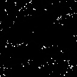
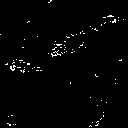

# Q. 41 - 50

## Q.51. モルフォロジー勾配

大津の二値化を行った後、モルフォロジー勾配を求めよ。

モルフォロジー勾配とはモルフォロジー膨張の画像と収縮の画像の差分をとることで、物体の境界線を抽出する手法である。

ここではモルフォロジー処理のN=1とする。

|入力 (imori.jpg) |出力(answer_51.jpg)|
|:---:|:---:|
|||

答え >> answer_51.py

## Q.52. トップハット変換

大津の二値化を行った後、トップハット変換を行え。

トップハット変換とは元画像からオープニング処理を行った画像を差し引いた画像であり、細い線状のものやノイズなどを抽出できると言われる。

ここでは、大津の二値化画像からオープニング処理画像(N=3)を差し引いて求めよ。

＊ここの問題だと効果が分かりにくいので、他の画像があればそのうち訂正します。

|入力 (imori.jpg) |大津の二値化(answer_4.jpg)|出力(answer_52.jpg)|
|:---:|:---:|:---:|
|||||

答え >> answer_52.py

## Q.53. ブラックハット変換

大津の二値化を行った後、ブラックハット変換を行え。

ブラックハット変換とはクロージング画像から元画像を差し引いた画像であり、これもトップ変換同様に細い線状やノイズを抽出できると言われる。

ここでは、クロージング処理画像(N=3)から大津の二値化画像を差し引いて求めよ。

＊ここの問題だと効果が分かりにくいので、他の画像があればそのうち訂正します。

|入力 (imori.jpg) |大津の二値化(answer_4.jpg)|出力(answer_53.jpg)|
|:---:|:---:|:---:|
|||||

答え >> answer_53.py
