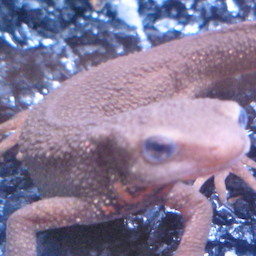

# 画像処理100本ノック!!

画像処理の初学者のための問題１００問。

きたれ！画像処理！！

## 環境設定

Python-3.6でやって下さい。
(解答はPython-3.6です)

### 1. Minicondaのインストール

https://conda.io/miniconda.html
のサイトからMinicondaをインストールします。

Minicondaがインストールできたら、以下コマンドで仮想環境を作成します。

```bash
$ conda create python=3.6 -n gasyori100
```

作成できたら、以下コマンドで仮想環境を動作します。

```bash
$ source actiavte gasyori100
```

### 2. パッケージのインストール

以下のコマンドで必要なパッケージをインストールします。


```bash
$ pip install -r requirement.txt
```

### 3. 画像処理チュートリアル

以下のファイルを作成し sample.py という名前で保存し、実行します。

```python
import cv2

img = cv2.imread("assets/imori.jpg")
cv2.imshow("lena", img)
cv2.waitKey(0)
cv2.destroyAllWindows()
```

```bash
$ python sample.py
```

これで以下の画像が表示されれば成功です！
何かボタンを押せば消えます。





これからは問題を解いていってください。
問では assets/imori.jpg を使用して下さい。

- 問題1-10  >> Quetion_01_10
- 問題11-20 >> Question_11_20
- 問題21-30 >> Question_21_30
- 問題31-40 >> Question_31_40
- 問題41-50 >> Question_41_50
- 問題51-60 >> Question_51_60
- 問題61-70 >> Question_61_70
- 問題71-80 >> Quesiton_71_80
- 問題81-90 >> Question_81_90
- 問題91-100 >> Question_91_100


## 注意

- 本稿は画像処理の基礎的な知識・理論を学ぶための教材です。
- 解答ではなるべくコードを簡易化するために、main()などを使用してしません。
- numpyを使用しますが、numpyに関する基本知識は載せません。各自調べて下さい。


## 問題

|番号|問題||番号|問題||番号|問題||番号|問題||番号|問題|
|---|---|---|---|---|---|---|---|---|---|---|---|---|---|
|1|チャネル入れ替え |21|ヒストグラム正規化
|2|グレースケール化 |22|ヒストグラム操作
|3|二値化 | 23|ヒストグラム平坦化
|4|大津の二値化 | 24|ガンマ補正
|5|HSV変換 
|6|減色処理
|7|平均プーリング
|8|Maxプーリング
|9|ガウシアンフィルタ
|10|メディアンフィルタ
|11|平滑化フィルタ
|12|モーションフィルタ
|13|MAX-MINフィルタ
|14|微分フィルタ
|15|Sobelフィルタ
|16|Prewittフィルタ
|17|Laplacianフィルタ
|18|Embossフィルタ
|19|LoGフィルタ
|20|ヒストグラム表示
